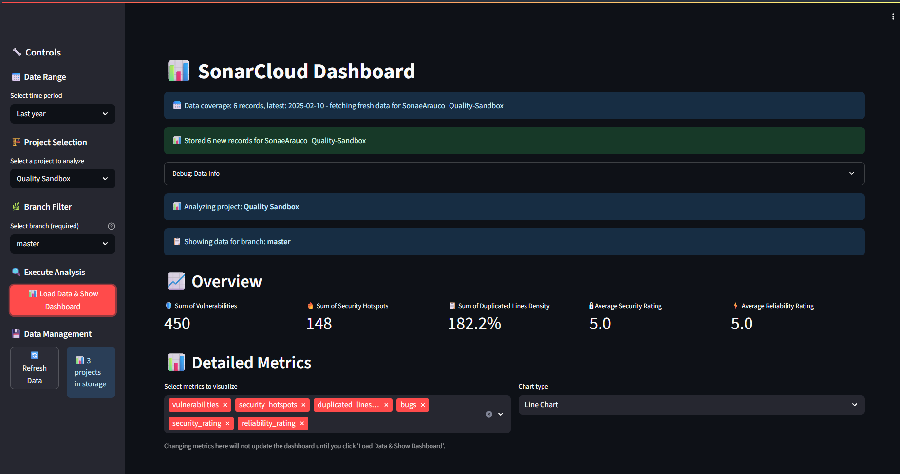
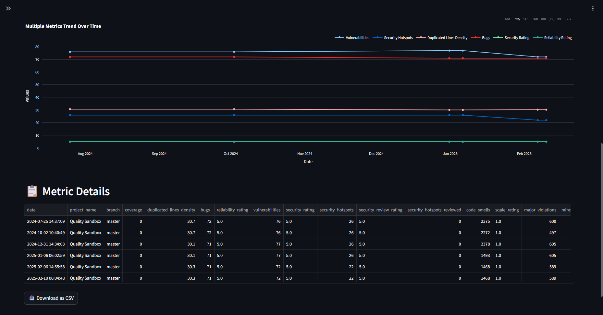

# SonarCloud Metrics Dashboard

**A Python tool to fetch, store, and visualize key project metrics from SonarCloud using interactive dashboards.**
Built with [Streamlit](https://streamlit.io/) and integrated with Azure Table Storage for efficient caching and historical data analysis.

---

## 🚀 Overview

SonarCloud Metrics Dashboard helps teams and developers gain insights into the health and quality of their codebases on [SonarCloud](https://sonarcloud.io).
Track code coverage, vulnerabilities, bugs, and more—across multiple projects and branches—with powerful visualizations.

---

## ✨ Features

* **Interactive Dashboards**: Visualize code quality trends with line, bar, and box plot charts.
* **Multi-Project Support**: Easily switch between projects and branches.
* **Historical Analysis**: Track metrics over customizable time periods (7, 30, 90, 180, 365 days).
* **Azure Table Storage Integration**: Persist metrics for fast reloads and offline analysis.
* **Data Export**: Download your filtered dashboard data as CSV.
* **Customizable Metrics**: Select which code health KPIs to analyze.

---

## 📸 Screenshots

<!-- Add screenshots or GIFs here, e.g.: -->




---

## 🛠️ Getting Started

### 1. Clone the Repository

```bash
git clone https://github.com/yourusername/sonarcloud-metrics-dashboard.git
cd sonarcloud-metrics-dashboard
```

### 2. Install Requirements

```bash
pip install -r requirements.txt
```

*You’ll need Python 3.8+.*

### 3. Set Up Environment Variables

Create a `.env` file in the root directory (or set these in your environment):

```env
SONARCLOUD_TOKEN=your_sonarcloud_token
SONARCLOUD_ORG=your_sonarcloud_organization_key
AZURE_STORAGE_CONNECTION_STRING=your_azure_storage_connection_string
```

* `SONARCLOUD_TOKEN`: [Generate a SonarCloud token](https://sonarcloud.io/account/security/).
* `SONARCLOUD_ORG`: Your organization key in SonarCloud.
* `AZURE_STORAGE_CONNECTION_STRING`: Azure Storage account connection string (see [Azure Docs](https://learn.microsoft.com/en-us/azure/storage/common/storage-configure-connection-string)).

### 4. Run the App

```bash
streamlit run app.py
```

Open the local Streamlit URL in your browser to use the dashboard.

---

## ⚙️ Usage

* **Select Organization, Project, and Branch:** Use the sidebar controls.
* **Pick a Date Range:** Analyze metrics over days, months, or a year.
* **Load Data & Show Dashboard:** Click the button to fetch and visualize metrics.
* **Export Data:** Download results as CSV.
* **Refresh:** Use the sidebar button to fetch the latest data from SonarCloud.

---

## 📦 Project Structure

* `app.py` — Main Streamlit app and dashboard logic.
* `sonarcloud_api.py` — Handles SonarCloud API integration.
* `azure_storage.py` — Manages Azure Table Storage persistence.
* `dashboard_components.py` — Visualization and dashboard UI components.

---

## 🧩 Dependencies

* [Streamlit](https://streamlit.io/)
* [Plotly](https://plotly.com/)
* [Pandas](https://pandas.pydata.org/)
* [python-dotenv](https://pypi.org/project/python-dotenv/)
* [azure-data-tables](https://pypi.org/project/azure-data-tables/)

---

## 📝 Contributing

Pull requests and issues are welcome! Please open an issue for bugs or feature requests.

---

## 📄 License

[MIT License](LICENSE).

---

## 🙏 Acknowledgments

* Built with [Streamlit](https://streamlit.io/) and the [SonarCloud API](https://sonarcloud.io/web_api).

