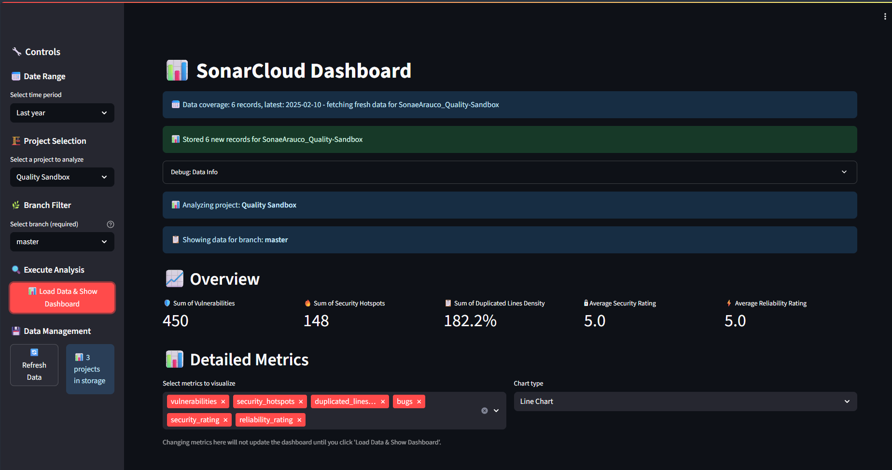

# 📊 SonarCloud Metrics Dashboard



## 📋 Project description
An enterprise-ready Streamlit dashboard for monitoring SonarCloud project metrics over time. It provides a fast, responsive UI with metric cards, interactive charts, and a storage abstraction that supports Azure Table Storage today and can be extended to PostgreSQL. Designed with teams in mind, it bridges the gap between raw data and actionable insights for your codebase health.

## ✨ Features
- **Enterprise Authentication**: Integrated with **Microsoft Entra ID (Azure AD)** via MSAL for secure, single sign-on access.
- **Multi-project insights**: Cached historical metrics and trend charts for a comprehensive view of your SonarCloud organization.
- **Professional UI Design**: Modern "Flat Enterprise" aesthetic with status-coded metric cards, optimized for both **Light and Dark modes**.
- **Storage abstraction**: Factory/strategy pattern (`database/`) decouples UI from the backend (Azure Table Storage supported).
- **High-Performance Ingestion**: Async SonarCloud API fetching with exponential backoff and memory-efficient Parquet compression.
- **Offline demo mode**: View the dashboard instantly using synthetic data (`demo/`).

## 🧱 Architecture Overview
```
src/dashboard/
├── app.py                  # Main entry point: Orchestration and session flow
├── data_service.py         # Data fetching, async API, and memory-aware caching
├── dashboard_view.py       # Metrics calculations and UI rendering logic
├── ui_styles.py            # Unified UI styling and theme management
├── sonarcloud_api.py       # SonarCloud API client + retry/backoff
├── dashboard_components.py # Reusable Plotly charts and card helpers
├── database/               # Storage interfaces + Azure Table Storage backend
├── demo/                   # Synthetic data generator for offline mode
└── styles.css              # Custom global CSS
```

### Key Design Choices
1. **Source Code Separation (`src/` layout)**  
   The application logic is isolated from deployment and configuration files, following modern Python best practices.
2. **Modular UI & Data Services**  
   The entry point (`app.py`) is decoupled from data processing (`data_service.py`) and visualization logic (`dashboard_view.py`), making the codebase easier to maintain and test.
3. **Storage Factory (`database/factory.py`)**  
   The UI uses `get_storage_client()` to resolve the backend. This keeps the application free of storage-specific concerns.
4. **Memory-aware rendering**  
   Heavy data is compressed and cached in session state using Parquet, and Plotly rendering is optimized to avoid unnecessary copies.
5. **Unified Theme Management**  
   A centralized styling system ensures visual consistency for buttons, inputs, and custom components across theme transitions.

## 🎨 UI Themes
The dashboard features a professional, high-contrast theme system:
- **Dark Mode**: Deep navy backgrounds with subtle borders and vibrant status accents.
- **Light Mode**: Clean, minimal "borderless" aesthetic with soft off-white backgrounds and professional corporate blue controls.
- **Switching**: Accessible via the User Profile popover in the sidebar.

## 🚀 Quick start
Get the application running locally instantly using Docker and Azurite (local storage), or use the offline demo mode:

**Option A: Offline Demo Mode**
```bash
git clone https://github.com/your-username/SonarCloudDashboard.git
cd SonarCloudDashboard
pip install -r requirements.txt
python src/dashboard/demo/demo_generator.py
streamlit run src/dashboard/app.py -- --demo-mode
```

**Option B: Docker + Azurite**
```bash
docker-compose up -d
```
Then open `http://localhost:8501` in your browser.

## 📦 Installation
### Prerequisites
- **Python 3.10+**
- **pip** (or `uv`)
- **SonarCloud API token**
- **Storage backend**: Azure Table Storage (production) or **Azurite** for local development

### Setup
1. Clone the repository:
   ```bash
   git clone https://github.com/your-username/SonarCloudDashboard.git
   cd SonarCloudDashboard
   ```
2. Install dependencies:
   ```bash
   pip install -r requirements.txt
   ```

## ⚙️ Configuration
Create a `.streamlit/secrets.toml` file based on your environment:
```toml
[database]
provider = "azure"

[azure_storage]
# Example using Azurite local emulator
connection_string = "DefaultEndpointsProtocol=http;AccountName=devstoreaccount1;AccountKey=...;TableEndpoint=http://127.0.0.1:10002/devstoreaccount1;"

[sonarcloud]
api_token = "sqp_your_token"
organization_key = "your-organization-slug"

[authentication]
client_id = "your-azure-ad-client-id"
tenant_id = "your-azure-ad-tenant-id"
authority = "https://login.microsoftonline.com/your-azure-ad-tenant-id"
```

> **Security note:** `secrets.toml` contains sensitive keys. Keep it out of version control.

## 💻 Usage examples
- **Viewing Trends**: Select a project from the sidebar dropdown to view its historical metrics (Bugs, Vulnerabilities, Code Smells, Coverage).
- **Theme Switching**: Click the user profile icon in the bottom-left sidebar to toggle between Dark Mode and Light Mode.
- **Forcing Data Refresh**: Use the 'Refresh Data' button to re-fetch the latest metrics from the SonarCloud API, bypassing the local cache.

## 🧪 Running tests
We use `pytest` for our testing framework. To run the complete test suite:
```bash
python -m pytest tests
```

## 📦 Requirements (Summary)
Main packages (see `requirements.txt` for full list):
- `streamlit`
- `pandas`, `numpy`
- `plotly`
- `azure-data-tables`
- `aiohttp`, `tenacity`, `urllib3`
- `msal`, `streamlit-cookies-manager`

## 🗺️ Future Improvements
- **PostgreSQL backend** using the existing storage interface (`database/`) for scalable persistence.
- Caching improvements for large multi-project dashboards.
- Role-based access controls for enterprise environments.

## 📝 Contributing
We welcome contributions to make the dashboard even better!
1. Fork the repository and create a feature branch: `git checkout -b feature/my-awesome-feature`
2. Commit your changes: `git commit -m "Add some awesome feature"`
3. Push to the branch: `git push origin feature/my-awesome-feature`
4. Open a Pull Request.

## 📄 License
This project is licensed under the MIT License. See the [LICENSE](LICENSE) file for details.
